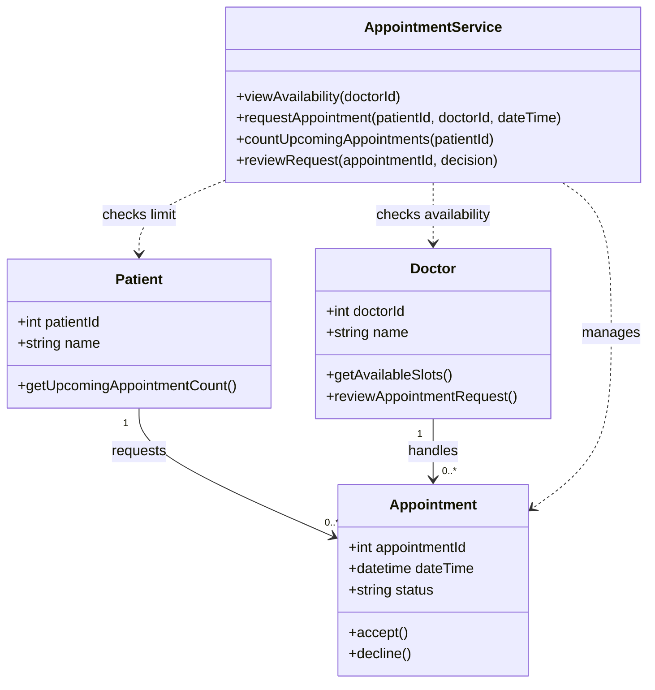

# Class Diagram

```mermaid
classDiagram
    class Patient {
        +int patientId
        +string name
        +getUpcomingAppointmentCount()
    }

    class Doctor {
        +int doctorId
        +string name
        +getAvailableSlots()
        +reviewAppointmentRequest()
    }

    class Appointment {
        +int appointmentId
        +datetime dateTime
        +string status
        +accept()
        +decline()
    }

    class AppointmentService {
        +viewAvailability(doctorId)
        +requestAppointment(patientId, doctorId, dateTime)
        +countUpcomingAppointments(patientId)
        +reviewRequest(appointmentId, decision)
    }

    Patient "1" --> "0..*" Appointment : requests
    Doctor "1" --> "0..*" Appointment : handles
    AppointmentService ..> Patient : checks limit
    AppointmentService ..> Doctor : checks availability
    AppointmentService ..> Appointment : manages
```
