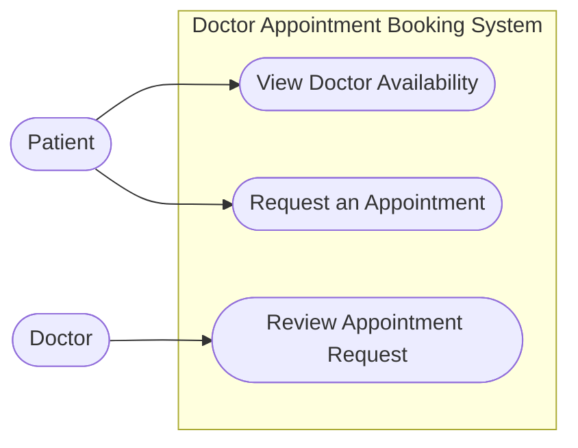

# Use Case Diagram

```mermaid
flowchart LR
    Patient([Patient])
    Doctor([Doctor])

    subgraph System["Doctor Appointment Booking System"]
        UC1([View Doctor Availability])
        UC2([Request an Appointment])
        UC3([Review Appointment Request])
    end

    Patient --> UC1
    Patient --> UC2
    Doctor --> UC3
```
